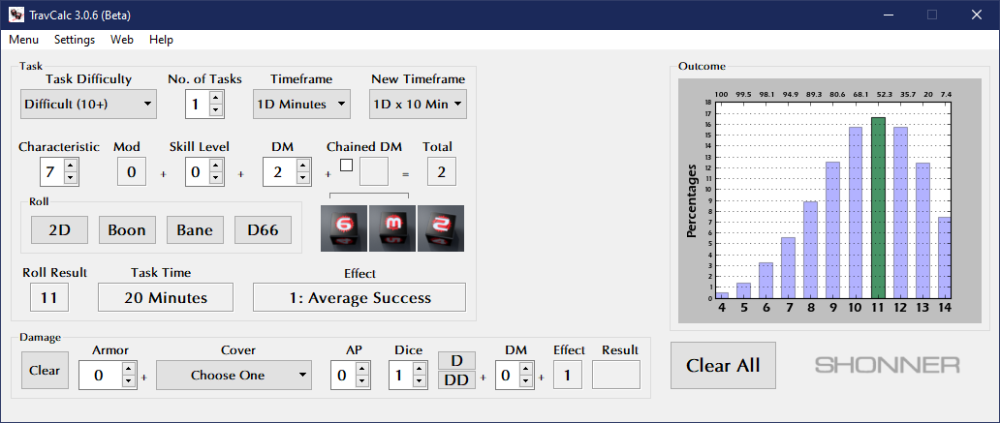

**TravCalc 3.0.3b**
===================

**TravCalc 3.0.3b** is a Windows program for calculating die rolls for Mongoose Traveller 2nd Edition. Check the ReadMe for instructions on installing and running this program.

Notes
-----

**TravCalc 3.0.3b** has been tested already on Windows XP/7/10.

The Traveller game in all forms is owned by Far Future Enterprises. Copyright 1977 - 2020 Far Future Enterprises. Traveller is a registered trademark of Far Future Enterprises.

Contact
-------
Questions? Please contact shawndriscoll@hotmail.com
