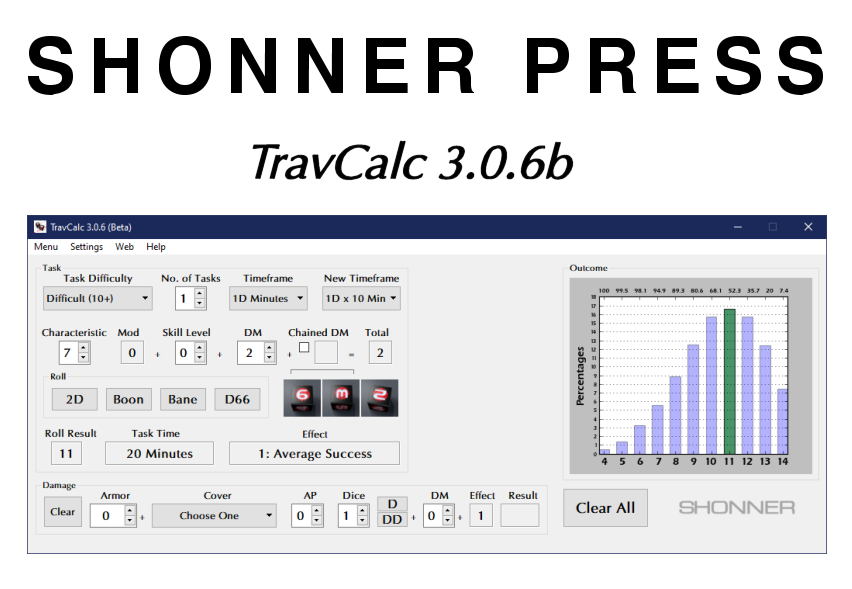

**TravCalc 3.0.6b**
===================

**TravCalc 3.0.6b** is a Windows program for calculating die rolls for Mongoose Traveller 2nd Edition. Check the ReadMe in DOCS for instructions on installing and running this program.

Notes
-----

**TravCalc 3.0.6b** has been tested already on Windows XP/7/10.

New in this release is the ability to add a cover modifier when hiding.

The Traveller game in all forms is owned by Far Future Enterprises. Copyright 1977 - 2021 Far Future Enterprises. Traveller is a registered trademark of Far Future Enterprises.

Contact
-------
Questions? Please contact shawndriscoll@hotmail.com
