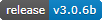

.. image:: docs/source/python_classic_2_5_tag.png
    :target: https://www.python.org/download/releases/2.5.4/
    

    
.. image:: https://readthedocs.org/projects/travcalcmanual/badge/?version=latest
    :target: http://travcalcmanual.readthedocs.io/en/latest/?badge=latest
    :alt: Doc Status
	
.. image:: https://img.shields.io/github/stars/ShawnDriscoll/TravCalc.svg
	:target: https://github.com/ShawnDriscoll/TravCalc/stargazers

**TravCalc 3.0.6b**
===================

.. figure:: images/travcalc_manual_cover_art.png

**TravCalc 3.0.6b** is a Windows program for calculating die rolls for Mongoose Traveller 2nd Edition.

Notes
-----

**TravCalc 3.0.6b** has been tested already on Windows XP/7/10.

New in this release is the ability to add a cover modifier when hiding.

Read the **TravCalc Manual** at http://travcalcmanual.readthedocs.io

Download the PDF from https://readthedocs.org/projects/travcalcmanual/downloads/pdf/latest

or the EPUB from https://readthedocs.org/projects/travcalcmanual/downloads/epub/latest

Requirements
------------

* **Windows XP/7/10**

   It might not work in OSX or Linux.

* **Classic Python 2.5**
   
   **TravCalc** was written using the C implementation of Classic Python
   version 2.5.4. Also known as CPython.
   
* **PyQt 4.9.4**

   PyQt is the framework used for displaying the Window GUI and buttons, etc.

* **numpy 1.7.1**

   For building arrays.

* **matplotlib 1.1.1**

   For graphics plotting.
   
* **py2exe 0.6.9**

   Used by setup_306b.py for making EXEs of the Python code for you. Optional.

Warning
-------

**TravCalc** will not work with **Python 2.6+**.

The Traveller game in all forms is owned by Far Future Enterprises. Copyright 1977 - 2021 Far Future Enterprises. Traveller is a registered trademark of Far Future Enterprises.

Contact
-------
Questions? Please contact shawndriscoll@hotmail.com
