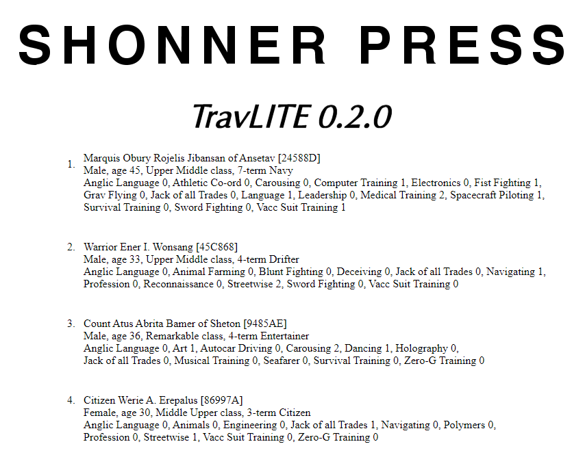

**TravLITE Guide**
==================

What began as a DOS prompt NPC generator escalated into a web-browsed one...

**TravLITE** is an easy-to-use open source NPC generator for Mongoose Traveller 1st and 2nd Editions. It's written
in Classic Python 2.5 and includes **diceroll 3.1** for its die rolling. Source for **diceroll 3.1** can be found at
its `GitHub
<https://github.com/ShawnDriscoll/diceroll/>`__ repository.

**TravLITE** features minor logging and error tracking at this time.

This documentation explains how to install and use **TravLITE** for Traveller NPC generation.

.. image:: python_classic_2_5_tag.png
    :target: https://www.python.org/download/releases/2.5.4/
    

.. image:: https://readthedocs.org/projects/travliteguide/badge/?version=latest
    :target: http://travliteguide.readthedocs.io/en/latest/?badge=latest
    :alt: Doc Status
	
The Traveller game in all forms is owned by Far
Future Enterprises. Copyright 1977 - 2021 Far Future
Enterprises. Traveller is a registered trademark of Far
Future Enterprises.

.. toctree::
   :maxdepth: 2

   introduction
   installing
   tutorial
   saveddata
   license
   ffe
   about_the_author
