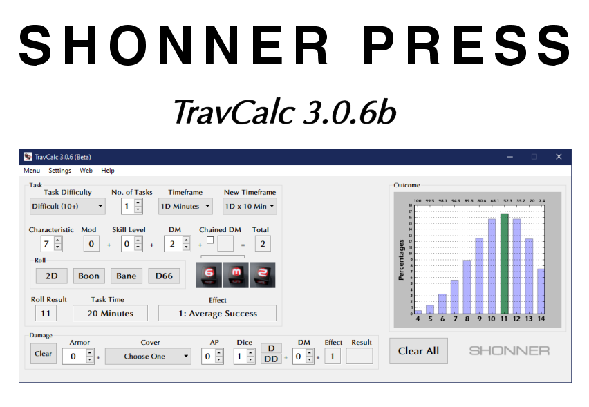

**TravCalc Manual**
===================

**TravCalc** is a Windows program for calculating die rolls for Mongoose Traveller
2nd Edition. It's written in Classic Python 2.5 and includes **diceroll 3.1** for
its die rolling. Source for **diceroll 3.1** can be found at
its `GitHub
<https://github.com/ShawnDriscoll/diceroll/>`__ repository.

**TravCalc** features minor logging and error tracking at this time.

This documentation explains how to install and use **TravCalc** for die roll calculations.

.. image:: python_classic_2_5_tag.png
    :target: https://www.python.org/download/releases/2.5.4/
    
.. image:: release_v3_0_6b_tag.png

.. image:: https://readthedocs.org/projects/travcalcmanual/badge/?version=latest
    :target: http://travcalcmanual.readthedocs.io/en/latest/?badge=latest
    :alt: Doc Status
	
The Traveller game in all forms is owned by Far
Future Enterprises. Copyright 1977 - 2021 Far Future
Enterprises. Traveller is a registered trademark of Far
Future Enterprises.

.. toctree::
   :maxdepth: 2

   introduction
   installing
   tutorial
   license
   ffe
   about_the_author
