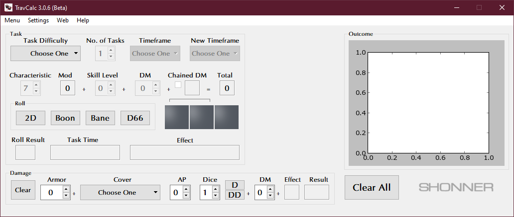

**TravCalc Tutorial**
=====================

The GUI
-------
After the program starts, there should be a screen that looks like:

The screen contains various outlined areas that are labeled as:

   | **Task:**
   | Choose the difficulty and die-modifiers for a task.
   |
   | **Roll:**
   | Choose the roll type to perform.
   |
   | **Damage:**
   | Calculate a damage roll.
   |
   | **Outcome:**
   | Displays a plotted graph of the roll chances and of the roll result, if a difficulty is chosen.

.. note::

   Plotted graphs are generated only when difficulties are selected. D66 rolls will never generate graphs.
   

Making a Task Roll
------------------
Typically, task rolls will have a difficulty chosen by the game's Referee. The player simply clicks the **Task Difficulty** button and clicks on the difficulty level. This will unlock the rest of the **Task** area that the player can fill in as well. It's pretty much self-explanatory how the rest is filled in. It is assumed that the player has a characteristic and skill in mind when changing these values.

.. note::

   The default characteristic value is **7**. Be sure to input your character's own value in its place before rolling any dice. The same goes for the skill level, which has a default of **0**. Give it the value of your character's skill level for the task being done.
   
   Don't worry about the characteristic mod amount. Its value is calculated automatically.