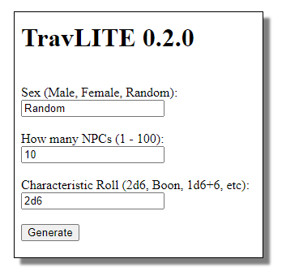
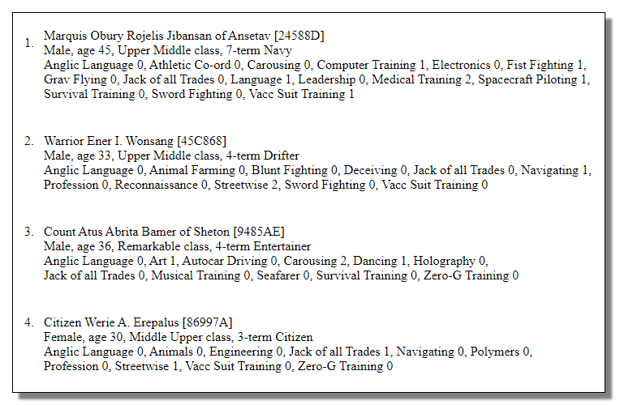

**TravLITE Tutorial**
=====================

The Screen
----------
In your web browser you will see:

Generating NPCs
---------------
For **Sex**, there are three choices:

   | *Male* = Generate Male NPCs only
   | *Female* = Generate Female NPCs only
   | *Random* = Generate NPCs of either sex
   
The default value is *Random*.

.. Warning::
   Your inputted data is **case-sensitive**.
   
For **How many NPCs**, choose a value from 1 to 100.

The default value is *10*.

For **Characteristic Roll**, you may enter a roll type that you are familiar with when doing your Traveller
character generation.
The common **Characteristic Roll** is *2d6*. Not so common rolls are *Boon* and *1d6+6*.

.. Warning::
   Whichever roll type you enter, keep in mind that the roll result range **must not be larger** than 2 - 15.

The generated NPCs will output in this format:

NPC names typically will start with a title, depending on their career or their social standing. Characters of nobility
will have longer names and include the homeworld they are from.

Next is the NPC's UPP, their sex, and age. The social class that an NPC was raised in is shown, along with how many terms
they were in a career.

And last is the NPC's list of skills.
